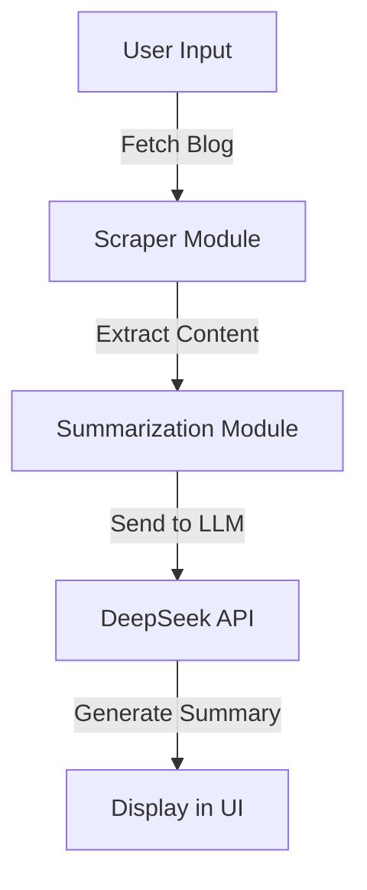

# 📝 AWS Blog Summarizer - Agentic GenAI Based Summarization  

## 📌 Overview  
The **AWS Blog Summarizer** is an **Agentic GenAI**-based application that **automates text summarization** of AWS blogs (or any other text content). It fetches blog posts, extracts relevant content, and generates **concise, structured summaries** using a **Large Language Model (LLM)**.   

### ✨ Key Features:  
- 🔍 **Scrapes blog posts** from AWS Big Data Blog (or any blog URL)  
- 🤖 **Summarizes text** using DeepSeek LLM via API  
- 🎯 **Extracts key insights**, including main topic, challenges, solutions, tools, and best practices  
- 🖥️ **Interactive UI** built with Streamlit  

## 🏰 Architecture  
🔹 **User Input:** Selects or enters a blog URL in the Streamlit UI  
🔹 **Scraper Module:** Fetches the blog content  
🔹 **Summarization Module:** Sends the extracted content to DeepSeek LLM via API  
🔹 **AI Processing:** Generates structured summaries  
🔹 **Output:** Displays the summarized content in an easy-to-read format  

### 📉 High-Level Flow:  


## 📂 Project Structure  
```
aws-blog-summarizer/
│── app/
│   ├── scraper.py  # Fetches blog content
│   ├── summarizer.py  # Calls DeepSeek API for summarization
│   ├── ui.py  # Streamlit UI to display results
│── .venv/  # Virtual environment
│── requirements.txt  # Required dependencies
│── README.md  # Project documentation
```

## 🚀 Setup & Installation  

### 1⃣ Clone the Repository  
```bash
git clone https://github.com/your-username/aws-blog-summarizer.git
cd aws-blog-summarizer
```

### 2⃣ Create a Virtual Environment & Install Dependencies  
```bash
python3 -m venv .venv  
source .venv/bin/activate  # On Mac/Linux
# On Windows: .venv\Scripts\activate  

pip install -r requirements.txt  
```

### 3⃣ Run the Streamlit App  
```bash
streamlit run app/ui.py  
```

### 4⃣ Deploy to GitHub  
If you haven't set up GitHub:  
```bash
git init  
git remote add origin https://github.com/your-username/aws-blog-summarizer.git  
git add .  
git commit -m "Initial commit"  
git push origin main  
```

## 🎯 Usage  
1⃣ **Run the app** and open in a browser  
2⃣ **Select an AWS blog** (or enter any blog URL)  
3⃣ **Click "Summarize"** to generate a structured summary  

## 📌 Future Enhancements  
✅ **Support for more data sources**  
✅ **Multi-language summarization**  
✅ **Enhancing AI responses with metadata**  

💡 **Open for contributions! Feel free to fork & submit PRs.** 🚀  

